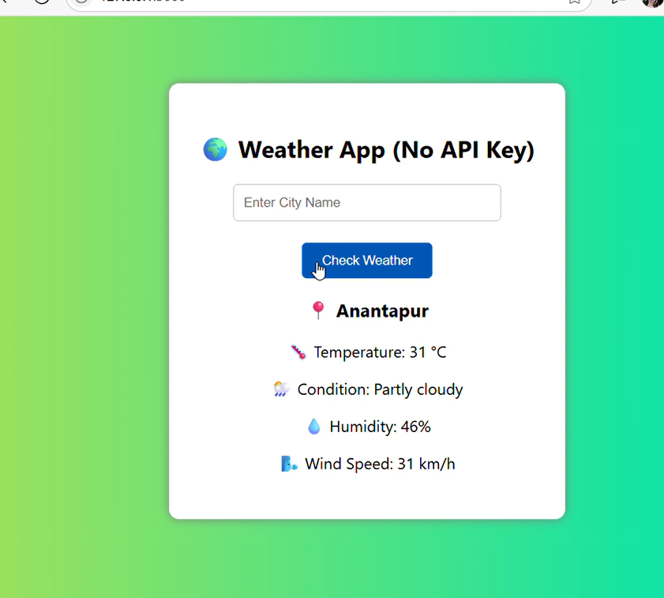

# 🌦️ OIBSIP_Python_Programming_Task3 – Weather App

## 🔍 Objective:
To build a simple Weather App using **Python and Flask**, where users can enter a city name and view the current weather conditions using live data.

---

## ⚙️ Tools Used:
- Python 3
- Flask (web framework)
- HTML & CSS
- Visual Studio Code (VS Code)

---

## 📝 Features:
- User can input any city name
- Displays:
  - Temperature
  - Weather description (e.g., Cloudy, Rainy)
  - Humidity
  - Wind speed
- Clean and responsive user interface
- Automatically shows error message for invalid cities

---

## ▶️ How to Run the Project in VS Code:

### 🔹 Step 1: Project Folder Structure
Ensure your files are organized as:
OIBSIP_Python_Programming_Task3/
├── app.py
├── templates/
│ └── index.html

shell
Copy
Edit

### 🔹 Step 2: Open the Folder in VS Code

### 🔹 Step 3: Install Flask
Open the terminal in VS Code and run:
```bash
pip install flask
🔹 Step 4: Run the App
bash
Copy
Edit
python app.py
🔹 Step 5: Open in Browser
Go to:

cpp
Copy
Edit
http://127.0.0.1:5000
📸 Screenshot:
🔹 Web App Interface


✅ Outcome:
A clean and interactive Weather App that fetches live weather data for any city and displays it to the user in an intuitive web interface.

📁 Folder Structure:
pgsql
Copy
Edit
OIBSIP_Python_Programming_Task3/
├── app.py
├── templates/
│   └── index.html
├── weather_app_ui.png
└── README.md
🧑‍💻 Author:
Pavani Chalapadi
Python Programming Intern – Oasis Infobyte (OIBSIP)

#OasisInfobyte #PythonProgramming #WeatherApp #Internship #LearningByDoing #FlaskProject


